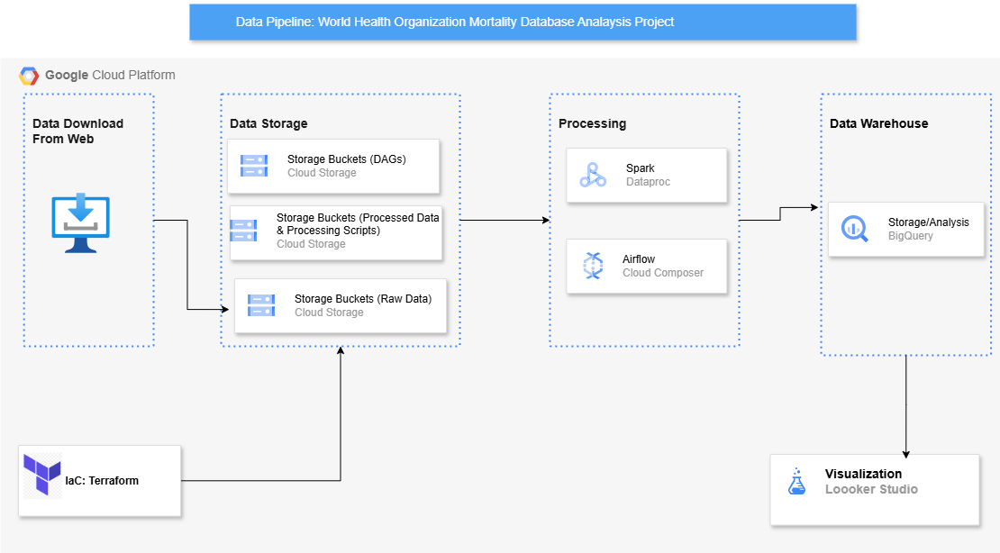
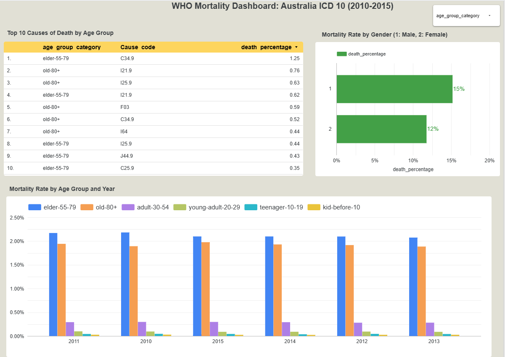
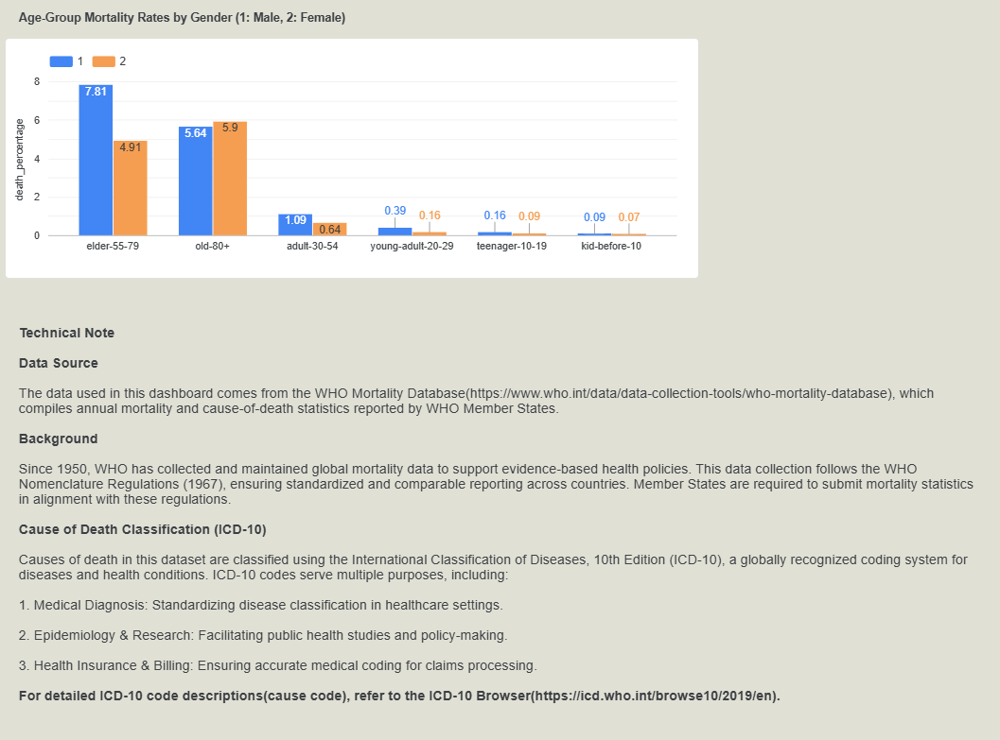
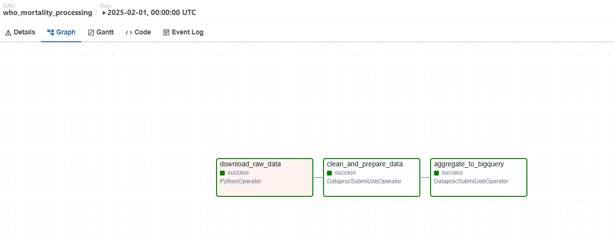

# World Health Organization Mortality Database Analysis Project

## Problem Description
This project analyzes mortality data from the [WHO Mortality Database](https://www.who.int/data/data-collection-tools/who-mortality-database) to identify top causes of death for specific age groups in selected countriy (Australia) and years (2010-2015). The WHO Mortality Database is the leading data source for comparative epidemiological studies of mortality by cause, making it valuable for public health research and policy-making.

## Solution Architecture
The project implements a cloud-based data pipeline that:
1. Ingests WHO mortality data in batch mode
2. Processes and transforms the data
3. Stores results in an optimized data warehouse
4. Presents findings in an interactive dashboard

## Technical Implementation

### Cloud Infrastructure
- **Platform**: Google Cloud Platform
- **Infrastructure as Code**: Terraform scripts provision all resources
- **Services Used**:
  - Cloud Storage (buckets for raw and processed data)
  - Cloud Composer (Airflow) for orchestration
  - Dataproc for Spark processing
  - BigQuery for data warehousing
  - Looker Studio for visualization

### Data Pipeline



#### Batch Processing Workflow
1. **Infrastructure Setup** (Terraform):
   - Creates GCS buckets, Cloud Composer environment, BigQuery dataset and table
2. **Data Ingestion**:
   - Download raw data to GCS bucket (`raw_bucket_guanyi`)
3. **Data Processing**:
   - Spark job cleans and prepares data (writes to `parquet_data_bucket`)
   - Spark aggregation job processes parquet files and loads to BigQuery
4. **Visualization**:
   - Looker Studio [Dashboard](https://lookerstudio.google.com/u/1/reporting/9e5517d1-7874-4c0f-a053-c902dddf8a3d/page/zKQFF) connects to BigQuery table 

### Data Warehouse
- The processed data is stored in **BigQuery** as a table for analysis

### Transformations
- Implemented using PySpark for:
  - Data cleaning and validation
  - Aggregation by  year, age group,gender, death cause
  - Calculation of mortality statistics
- Transformation logic is contained in:
  - `spark_data_prep.py`
  - `spark_aggregation.py`

### Dashboard
The Looker Studio dashboard provides:
1. **Top Causes of Death** visualization
   - Filterable by  age group
   - Shows proportional mortality by cause
2. **Trend Analysis** visualization
   - Shows mortality trends over time for age group
3. **Technical Notes** reference
   - Please refer to the technical note to check the original data source and ICD-10 Code description




## Reproducibility
To run this project:

### Prerequisites
- Google Cloud account with necessary permissions
- Terraform installed
- gcloud CLI configured

### Deployment Steps
1. **Infrastructure Setup**:
   ```bash
   terraform init
   terraform plan
   terraform apply

2. **Airflow Configuration**:

- Step 1: Access Airflow UI through Cloud Composer**

   Setup the following variables:

        | key      | values |
        | -------- | ------- |
        | REGION  | us-central1|
        | GCP_GUANYI_PROJECT | oval-sunset-455016-n0|
        | bq_dataset_name    | 	oval-sunset-455016-n0.Australia_Mortality_Dataset|
        | gcs_bucket_raw  | raw_bucket_guanyi|
        | gcs_bucket_parquet  | parquet_data_bucket|   

- Step 2: Upload spark_data_prep.py and spark_aggregation.py to appropriate GCS buckets

- Step 3: Upload who_mortality_processing.py to the Composer bucket's dags/ folder

- Step 4: Execute Pipeline:

    Trigger the DAG manually in Airflow UI
    

- Step 5: Monitor jobs in Dataproc and view logs

